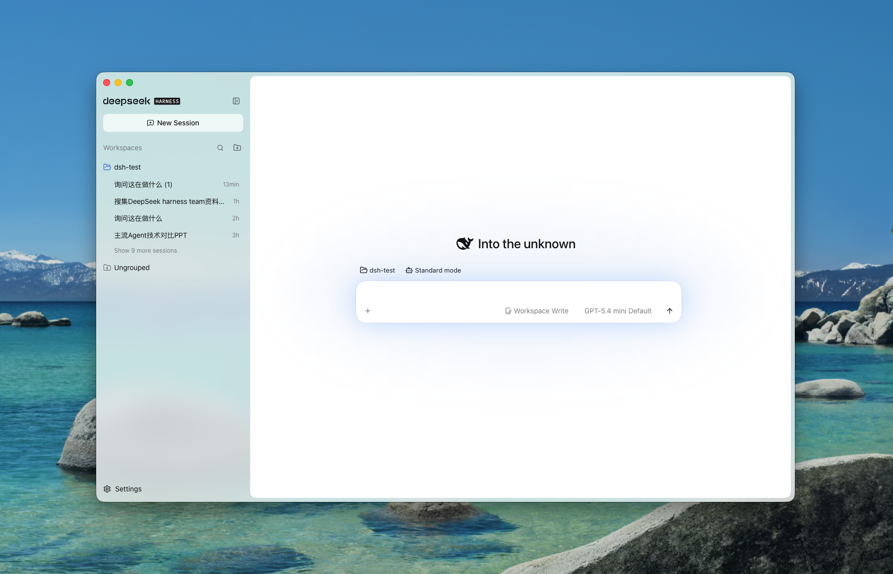

# DeepSeek Harness UX First

这个以用户体验为先的 DeepSeek Harness 桌面客户端：保留官方完整功能，打磨极致交互体验，开箱即用，持续更新！

> A polished, ready-to-run desktop experience for DeepSeek Harness.

<picture>
  <source media="(prefers-color-scheme: dark)" srcset="docs/images/dark.png">
  <source media="(prefers-color-scheme: light)" srcset="docs/images/light.png">
  
</picture>

## 项目介绍

DeepSeek Harness UX First 基于官方 DeepSeek Harness 构建，致力于提供媲美 Codex 的 Coding 产品使用体验。

项目不分叉或长期修改 Harness 官方源码，而是在保留官方能力和生态兼容性的基础上，通过桌面封装与插件扩展，持续优化视觉、交互、Reasoning 和复杂任务的执行体验。

## v1.0 亮点

- **全新的桌面视觉体验**：重新打磨侧栏、对话区、输入区、菜单和交互状态，让界面更加清晰、统一。
- **更易理解的生成过程**：优化生成中的 Reasoning、执行进度和工具活动呈现，让复杂 Coding 任务更容易跟随和掌控。
- **保留官方完整功能**：继续使用官方 `@deepseek-ai/dsh` 软件包，保留 Harness 原有的会话、工具和输入逻辑。
- **开箱即用**：正式安装包内置 Node、Harness 和运行依赖，无需单独安装 Node 或 npm。
- **兼容 Harness 生态**：保持对 Plugins、MCP、Skills 和工具生态的兼容。
- **多平台支持**：提供 macOS Apple Silicon、macOS Intel 和 Windows x64 版本。

## 当前版本：v1.0

DeepSeek Harness UX First 1.0 已正式发布。

v1.0 在保留 DeepSeek Harness 官方完整能力的基础上，重点优化了桌面端视觉体验，以及生成过程中的 Reasoning、执行进度和工具活动呈现，让复杂 Coding 任务更加清晰、自然、易于掌控。

| 平台 | 状态 |
| --- | --- |
| macOS Apple Silicon | v1.0 已发布 |
| macOS Intel | v1.0 已发布 |
| Windows x64 | v1.0 已发布 |

## 下载与安装

前往 [GitHub Releases](https://github.com/Jesse-Lai/DeepSeek-Harness-Desktop-UX-First/releases) 下载 v1.0：

- macOS Apple Silicon
- macOS Intel
- Windows x64

下载对应平台版本后即可直接运行，无需单独安装 Node、npm 或 DeepSeek Harness。

## 快速开始

1. 从 GitHub Releases 下载对应平台的 v1.0 安装包。
2. 解压或安装应用。
3. 启动 DeepSeek Harness UX First。
4. 按照界面指引完成配置并开始使用。

## 产品方向

DeepSeek Harness UX First 基于 DeepSeek Harness 打造，致力于提供媲美 Codex 的 Coding 产品使用体验。

在持续打磨视觉、交互、Reasoning 和任务执行体验的同时，项目也将基于 DeepSeek Harness 的插件理念进行产品创新：

- 探索插件驱动的 Coding 工作流
- 扩展 Plugins、MCP、Skills 和工具生态
- 创新复杂任务的进度、Reasoning 与活动呈现
- 持续提升桌面端 Coding Agent 的可用性和掌控感

## 与官方 DeepSeek Harness 的关系

本项目使用固定版本的官方 `@deepseek-ai/dsh` npm 软件包，不复制或长期修改 Harness 官方源码。桌面端的视觉与交互增强通过 Harness 配置和插件机制实现，以尽可能保持官方能力与生态兼容性。

DeepSeek Harness UX First 是社区项目，与 DeepSeek 官方无隶属关系。有关 Harness 本身的功能和许可，请参阅 [DeepSeek Harness 官方仓库](https://github.com/deepseek-ai/deepseek-harness)。

## 本地开发

需要 Node.js 和 npm。克隆仓库后运行：

```bash
npm ci
npm test
npm start
```

macOS 上也可以生成一个从 Finder 双击启动、直接读取当前项目源码的开发版：

```bash
npm run app:dev:mac
```

`node_modules` 和 `dist` 仅保留在本机，不提交到 GitHub。

## 参与贡献

欢迎通过 Issues 提交问题、建议和产品想法，也欢迎通过 Pull Requests 参与功能、交互、插件和文档改进。

## License

本项目采用 MIT License。第三方依赖和相关许可信息请参阅 [THIRD_PARTY_NOTICES.md](THIRD_PARTY_NOTICES.md)。
